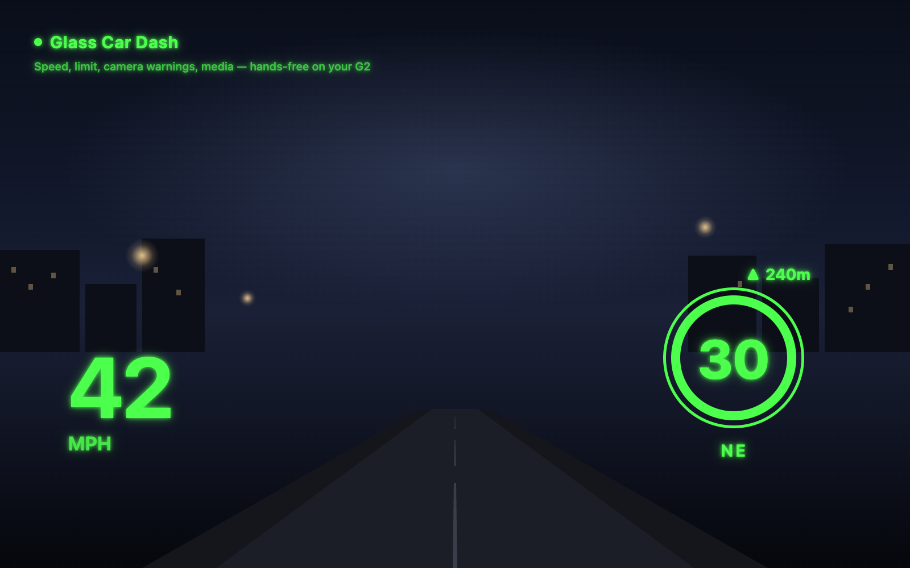

# Glass Car Dash — a driving dashboard + media remote for the Even Realities G2



One screen, split in two: your media remote on the left, a live driving
dashboard on the right — current speed, local speed limit shown as a
circular road-sign graphic (from your phone's GPS + the OSM Overpass API),
compass heading, current road name, speed camera proximity warnings, and
glasses + phone battery, all visible at a glance while you drive.

The remote side controls whatever's playing on your phone. No
media-app-specific integration: it works by sending standard Android media
keyevents via ADB, so it works with Spotify, YouTube Music, podcasts,
anything — and shows the current track title + artist when it can
(best-effort, see [Troubleshooting](#troubleshooting)).

**Gestures:**
- **Tap** = play/pause
- **Swipe up** = next track
- **Swipe down** = previous track
- **Double-tap** = exit

The phone screen isn't just a "check the glasses" placeholder — it shows a
live preview of exactly what's on the glasses display, and the buttons
underneath fire the same play/pause/next/previous/exit gestures, so you can
control everything from the phone too.

Actual on-device UI (captured from the official Even Hub simulator, not a
mockup):

 

## How it works

```
G2 glasses ──BLE── Even app (phone WebView) ──HTTP── Glass Car Dash backend ──ADB── this same phone's media session
             (the app you install)             (runs in Termux, on the phone)
```

The glasses app can't talk to Android's media controls directly — it's a
WebView with no access to system APIs. So a small backend runs in
**Termux** (a terminal app) on your own phone, and it sends media keyevents
via **ADB** (Android Debug Bridge) connected to that same phone over Wi-Fi.
This is "self-ADB": your phone debugging itself, no computer involved.

Everything runs on the one device. Nothing is sent anywhere else — no
cloud, no other server. The backend only ever listens on `127.0.0.1`
(the phone's own loopback), so nothing outside the phone can reach it either.

---

## What you'll need

- An Even Realities G2 and the Even app
- **Developer options + Wireless debugging enabled** on your phone
  (**Settings → About phone → tap "Build number" 7 times**, then
  **Settings → System → Developer options → Wireless debugging → ON**) —
  everything here talks to your phone's own media session via adb, which
  needs this on and paired
- **Termux** — install from **F-Droid**, not the Play Store (the Play
  Store version is outdated and unsupported; F-Droid's is the one that
  gets updates: <https://f-droid.org/packages/com.termux/>)
- **Termux:API** — companion app, also from F-Droid
  (<https://f-droid.org/packages/com.termux.api/>). Powers the phone battery
  reading on the dashboard (`termux-battery-status`); everything else works
  without it.
- **Termux:Boot** — only needed for the backend to auto-start after a phone
  reboot. The quick install below installs and launches it for you
  automatically over adb; see
  [Making it survive a reboot](#making-it-survive-a-reboot-termuxboot) if you
  ever need to do it manually instead.
- 10-15 minutes for the one-time setup

---

## Quick install

**Before you start:** enable Developer options and Wireless debugging on
your phone — the installer needs an authorized adb connection to install
Termux:Boot and to reach your phone's media session at all, and Android
requires this to be turned on and paired by hand (**Settings → About phone
→ tap "Build number" 7 times**, then **Settings → System → Developer
options → Wireless debugging → ON**). You don't have to pair it yet, though
— the installer below detects whether you have and walks you through
pairing if not.

Once Termux is installed and opened once (to let it finish first-run setup),
paste this into Termux:

```bash
curl -fsSL https://raw.githubusercontent.com/drrobotk/glass-car-dash/main/install.sh | bash
```

This installs the required packages (including `adb` itself), clones the
backend, sets up config (the default key already matches the pre-built
`.ehpk` below — no editing needed), installs and launches Termux:Boot for
reboot persistence, and starts the backend.

**If wireless debugging isn't paired yet, this takes two runs**: the first
installs `adb` and prints the exact pairing + connect steps (reading a
6-digit code off your phone's screen — this part genuinely can't be
automated); follow them, then re-run the same command above to finish,
including the Termux:Boot install, which needs that adb connection to work.
Safe to re-run any number of times either way.

Then, install the glasses app itself:

- **If Glass Car Dash is listed on the Even Hub store:** open the Even app
  on your phone, search "Glass Car Dash", tap Install. Done — skip the rest
  of this step.
- **Otherwise** (not published yet, or you want an unreleased/dev build):
  upload `glass-car-dash.ehpk` (from this repo's
  [Releases](https://github.com/drrobotk/glass-car-dash/releases)) at
  <https://hub.evenrealities.com> (Developer hub), then on your phone:
  **Even app → Developer hub → unpublished plugins → Glass Car Dash**.

That's it. Everything below is the same process broken into manual steps —
useful if you want to understand or customize each one, or if something
above didn't work.

---

## Manual install (step by step)

## 1. Install Termux + companion apps

Install all three F-Droid apps above. Open **Termux** once to let it finish
its first-run setup, then run:

```bash
pkg update -y
pkg install -y nodejs-lts android-tools termux-api unzip
```

- `nodejs-lts` — runs the backend (zero other dependencies)
- `android-tools` — provides the `adb` command
- `termux-api` — lets Termux talk to Android; powers the phone battery
  reading on the dashboard (`termux-battery-status`) specifically
- `unzip` — to extract the backend package

## 2. Enable wireless debugging and pair Termux to your own phone

On your phone:

1. **Settings → About phone → tap "Build number" 7 times** (enables
   Developer options, skip if already enabled)
2. **Settings → System → Developer options → Wireless debugging → ON**
3. Tap **Wireless debugging** to open it, note the **IP address and port**
   shown (you'll need this for pairing) — this looks like
   `192.168.1.xxx:xxxxx`
4. Tap **Pair device with pairing code** — this shows a 6-digit code and a
   *separate* pairing IP:port

Back in Termux:

```bash
adb pair <pairing-ip>:<pairing-port>
# Enter pairing code: <the 6-digit code from your phone>
```

You should see `Successfully paired`. Pairing only needs to happen **once**
(it establishes trust); this is the trickiest step, everything after this
is much simpler.

## 3. Connect and fix the port

Wireless debugging's normal connect port **rotates** every time you toggle
it or reboot — annoying to look up each time. Fix it to a constant port:

```bash
adb connect <ip-address-and-port-from-step-2>
adb tcpip 5555
```

From now on (until your next reboot — see the persistence section below),
reconnect via **loopback, not the phone's Wi-Fi IP**:

```bash
adb connect 127.0.0.1:5555
```

This matters more than it looks: `adb tcpip` mode binds all interfaces,
including loopback, and since Termux and adbd are both running on the same
phone, `127.0.0.1:5555` works with **no Wi-Fi or signal at all** — verified
directly (a real `adb shell` command executed successfully over it with
Wi-Fi disconnected). Connecting via the phone's Wi-Fi IP instead only works
on that specific network, which breaks the moment you leave it — this was
the actual cause of the app not working away from home Wi-Fi (e.g. in a
car) in an earlier version of this setup. Always use `127.0.0.1:5555`.

Verify it worked:

```bash
adb devices -l
# should show your phone, ending in "device" (not "unauthorized" or "offline")
```

## 4. Get the backend onto your phone

Take the `glass-car-dash.zip` from this release and get it onto your phone
(AirDrop, email to yourself, whatever you normally use) — it typically lands
in your Downloads folder. Then in Termux:

```bash
cd ~
unzip -o ~/storage/downloads/glass-car-dash.zip -d glass-car-dash
cd glass-car-dash
```

(If `~/storage/downloads` doesn't exist yet, run `termux-setup-storage`
once first, grant the permission Android asks for, then retry.)

## 5. Run setup and configure your key

```bash
bash setup.sh
```

This checks for Node/adb, confirms your device is connected, and tells you
if `.env` is missing. If it's missing:

```bash
cp .env.template .env
nano .env
```

Set `REMOTE_KEY` to any string you like (it doesn't need to be secret —
its purpose is forcing a CORS preflight so a random webpage can't fire a
media command cross-origin, not hiding a password. Same value used by the
app you'll install in step 7). Save with `Ctrl+O`, `Enter`, then `Ctrl+X`.

## 6. Start the backend

```bash
./start.sh --bg
```

Check it's alive:

```bash
curl http://127.0.0.1:8790/api/health
# {"ok":true}
curl http://127.0.0.1:8790/api/media/status -H "x-remote-key: <your key>"
# should show "connected": true
```

`--bg` survives closing the Termux app. It does **not** survive a phone
reboot on its own — see the persistence section below for that.

## 7. Install the Glass Car Dash app

**If it's listed on the Even Hub store**, just search "Glass Car Dash" in
the Even app and tap Install — skip the rest of this step.

Otherwise: upload `glass-car-dash.ehpk` at <https://hub.evenrealities.com>
(Developer hub), then on your phone: **Even app → Developer hub →
unpublished plugins → Glass Car Dash**. Either way, it calls
`127.0.0.1:8790` directly — no QR code needed, since the app and backend
are the same device.

> If you're building this yourself rather than using a pre-built `.ehpk`,
> make sure `app/.env.production` has the same key you set in step 5:
> ```
> VITE_API_BASE=http://127.0.0.1:8790
> VITE_API_KEY=<your key from .env>
> ```
> then `cd app && npm install && npm run build && npm run pack`.

That's it — the remote should work now. Everything below is optional but
recommended.

---

## Making it survive a reboot (Termux:Boot)

Without this, a phone reboot means you have to manually run
`cd ~/glass-car-dash && ./start.sh --bg` again. With it, the backend
auto-starts.

**If you used the [Quick install](#quick-install) one-liner, this is already
done** — `install.sh` installs Termux:Boot and launches it once
automatically via adb (skip to the "one thing this doesn't solve" note
below). The steps here are for doing it by hand:

1. Install **Termux:Boot** from F-Droid
   (<https://f-droid.org/packages/com.termux.boot/>) and **open it once** —
   just launch it, no need to do anything inside. This matters: Android's
   "unused apps" restrictions can block a never-opened app's boot receiver
   from ever firing, even after installation.
2. Create the boot script:
   ```bash
   mkdir -p ~/.termux/boot
   cat > ~/.termux/boot/start-glass-car-dash.sh << 'EOF'
   #!/data/data/com.termux/files/usr/bin/bash
   sleep 5
   cd ~/glass-car-dash && ./start.sh --bg
   EOF
   chmod +x ~/.termux/boot/start-glass-car-dash.sh
   ```
3. That's it. On your next reboot, the backend will start on its own.

**The one thing this doesn't solve**: the ADB *connection* itself does not
survive a reboot on an unrooted phone — `adb tcpip 5555` resets back to
USB-only mode every time Android restarts `adbd`. So after a reboot:

- The backend auto-starts (thanks to Termux:Boot) and reports "not
  connected" — this is expected, not a bug.
- Reconnect once: **Settings → Wireless debugging** (toggle on if needed),
  then in Termux: `adb tcpip 5555` (over that connection), then
  `adb connect 127.0.0.1:5555` (loopback — see step 3 above for why).
- The remote starts working immediately, no restart needed, and from this
  point on works with no Wi-Fi/signal at all until the next reboot.

There's no way around this manual step without root (rooted devices can set
`persist.adb.tcp.port` to survive reboots automatically; unrooted ones
can't). If you reboot rarely, this is a once-in-a-while inconvenience, not
a daily one.

---

## Troubleshooting

| Symptom | Fix |
|---|---|
| "Not connected" on the glasses | Run `adb devices -l` in Termux — if empty or "offline", reconnect: `adb connect 127.0.0.1:5555` (loopback — works with no Wi-Fi/signal; re-run `adb tcpip 5555` first if that also fails, which needs a network or USB, see the reboot section above) |
| Worked at home, "not connected" away from home Wi-Fi (e.g. in a car) | You're connected via the phone's Wi-Fi IP instead of loopback. Run `adb disconnect <wifi-ip>:5555` then `adb connect 127.0.0.1:5555` — loopback has no network dependency at all, this is the fix |
| `adb connect` refuses / times out | Wireless debugging may have been toggled off. Check Settings → Wireless debugging is still on, and re-pair only if the "no such paired device" error appears — normally just reconnecting via `127.0.0.1:5555` is enough |
| "bad key" error | Your `.env`'s `REMOTE_KEY` doesn't match what's baked into the `.ehpk`'s `VITE_API_KEY`. They must be identical strings |
| Backend won't start / port in use | `./start.sh --stop` then `./start.sh --bg` again; check `~/glass-car-dash.log` for errors |
| Taps do nothing at all | Confirm the backend is actually running: `curl http://127.0.0.1:8790/api/health` from Termux |
| Works, then stops after a while | Android may be killing Termux to save battery. Termux's own notification (swipe-down, "Termux running") has a toggle to acquire a wake lock — enable it, or run `termux-wake-lock` once in the session |
| Boot script doesn't fire after reboot | Confirm Termux:Boot is installed AND has been opened at least once (`adb shell pm list packages \| grep termux.boot` to confirm install; if it never ran, Android's app-hibernation may have blocked it — open it manually once) |
| Phone battery % never shows | Confirm Termux:API is installed (not just the `termux-api` package — the separate F-Droid app) and run `termux-battery-status` directly in Termux to check it returns JSON |
| Now-playing title never shows | Best-effort only — it's parsed from `adb shell dumpsys media_session`, an undocumented debug dump, not a stable API. Some apps don't publish session metadata, and the parsing may not match every Android version/OEM. The dashboard works fine without it |
| Now-playing takes a while to update after next/previous | An extra check fires ~1s after a successful next/previous/play-pause tap (rather than waiting for the regular 20s poll) — if the target app is slow to publish new session metadata (buffering, etc.) it can still take a moment past that |
| Artist shown twice, or not at all | The artist is only appended if it isn't already part of the title (some apps report "Artist - Title" as one field, others report title and artist separately) — this is a heuristic over an undocumented format, not exact for every app |
| Speed limit stuck on "…" the whole drive | Overpass's public instance rate-limits under real use (confirmed live) — the app already tries two free mirrors as fallback before giving up, but if all three are down/rate-limited at once you'll see this. It should recover on its own as soon as any one of them responds |
| "panel: sendFailed" briefly shown, then goes away | Expected occasionally — the dashboard image is pushed once a second over BLE, and a single failed send isn't shown (only 3+ in a row); this is just a transient wireless hiccup, not a bug |

## Debugging speed/limit accuracy

If the shown speed or speed limit seems off on a drive, there's an opt-in
diagnostic log — every GPS fix and every Overpass lookup (with every
candidate road it considered, not just the one it picked) gets recorded, so
a real drive's data can be reviewed afterward instead of guessed at.

Off by default (see [Privacy](#privacy)). To enable it for one drive:

```bash
echo "DEBUG_LOG=1" >> ~/glass-car-dash/.env
cd ~/glass-car-dash && ./start.sh --stop && ./start.sh --bg
```

Drive, then pull `~/glass-car-dash-debug.log` off the phone (e.g. `scp` over
Termux's SSH, or `adb shell run-as com.termux cat ~/glass-car-dash-debug.log`
if the Termux build is debuggable). Turn it back off afterward the same way
(remove the line, restart the backend) — it's meant for a deliberate
debugging session, not to run continuously.

## Uninstalling

```bash
cd ~/glass-car-dash && ./start.sh --stop
rm -rf ~/glass-car-dash ~/.termux/boot/start-glass-car-dash.sh
```
Then remove the Glass Car Dash app from the Even app same as any other plugin.

## A note on what you're enabling

Wireless debugging + ADB is a genuinely powerful capability — it's the same
access a developer uses to install and debug apps. Pairing requires a
6-digit code shown on your own phone's screen each time you pair, so a
stranger on the same Wi-Fi can't connect without physical access to your
device. Still, it's worth understanding what you're turning on: anyone who
already has an authorized, paired connection to your phone has broad
control over it. Turn off Wireless debugging in Settings when you don't
expect to need it for a while, if that matters to you.

## Privacy

No accounts, no analytics, no data collected or stored by the developer.
GPS coordinates go directly from your phone to OpenStreetMap's public
Overpass API (or one of two mirrors, tried only if the primary is
rate-limited/unavailable — all free, no accounts or API keys) for speed
limit/camera lookups; media commands, phone battery, and the now-playing
track title all go through (or come from) your own backend on
`127.0.0.1` and never leave the device. Full details
in [`docs/store/STORE_LISTING.md`](docs/store/STORE_LISTING.md).

## License

[MIT](LICENSE)
